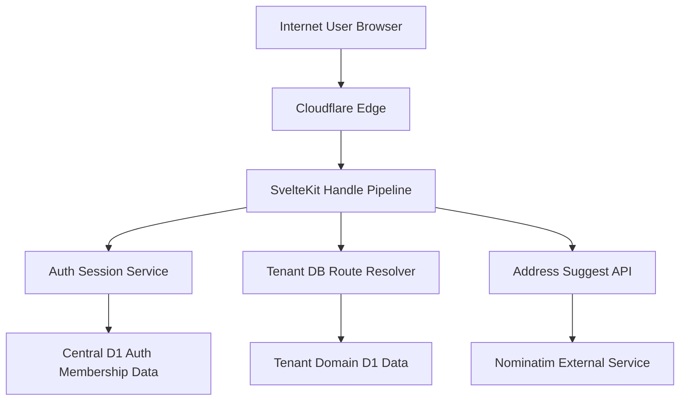

## Executive summary
PlayIMs has solid baseline controls for an MVP (server-side auth hydration, route RBAC policy, input validation, and session-token hashing), but the highest-risk themes are privilege and environment boundaries: `self-join` currently grants `manager`, production currently points at the dev D1 database, and destructive tenant-domain operations can be executed by manager-level accounts with large blast radius. The most important immediate fixes are to enforce least-privilege joins, separate production data from development, and tighten destructive-action authorization and atomicity.

## Scope and assumptions
- In-scope paths:
`src/hooks.server.ts`, `src/routes/api/**`, `src/routes/**/+page.server.ts`, `src/lib/server/auth/**`, `src/lib/server/database/context.ts`, `src/lib/database/schema/**`, `wrangler.toml`, `docs/tenancy-architecture.md`
- Out of scope:
UI-only styling behavior, generated build output (`.svelte-kit`), and third-party service internals (Cloudflare, OpenStreetMap/Nominatim).
- Confirmed context from service owner:
production currently uses the dev D1 database for real customer traffic; cross-tenant isolation via app-layer checks is acceptable short-term; self-join should default to `player`.
- Assumptions used for ranking:
internet-facing SaaS, moderate user count, cookie-session auth, no database-native row-level security, and manager/admin are both currently dashboard-privileged roles.
- Open questions that could change ranking:
whether any API tokens/admin backdoors exist outside this repo; expected data retention/compliance obligations; target cutover date for production DB isolation.

## System model
### Primary components
- Browser SPA/SSR pages and form actions (SvelteKit routes and server actions): `src/routes/**`
- Central request security pipeline (auth hydration, RBAC gate, CSRF origin check, rate limiting, headers): `src/hooks.server.ts`
- Auth/session service layer (password hashing, cookie/session issuance, membership context): `src/lib/server/auth/service.ts`, `src/lib/server/auth/session.ts`, `src/lib/server/auth/password.ts`
- Tenant DB route resolver and DB operation factories: `src/lib/server/database/context.ts`
- Central + tenant domain data in D1 (currently mostly `central_shared`): `docs/tenancy-architecture.md`, `src/lib/database/schema/*.ts`
- External geocoding integration: `src/routes/api/address-suggest/+server.ts`
- Cloudflare deployment and D1 bindings (including current prod->dev DB mapping): `wrangler.toml`

### Data flows and trust boundaries
- Internet user -> SvelteKit SSR/API handlers
  - Data crossing: credentials, session cookies, form/JSON payloads, tenant identifiers, domain objects.
  - Channel/protocol: HTTPS HTTP requests through Cloudflare.
  - Security guarantees: route policy allowlist and auth/RBAC checks in `handle`; CSRF same-origin enforcement for mutating requests; per-route rate limits.
  - Validation: Zod schemas for login/register/switch/join and domain payloads.
  - Evidence: `src/hooks.server.ts` (`API_ROUTE_POLICIES`, `isTrustedOrigin`, `consumeRateLimit`), `src/lib/server/auth/validation.ts`.

- SvelteKit server -> Central auth/membership store (D1)
  - Data crossing: user records, session token hashes, membership mappings, client routes.
  - Channel/protocol: in-process D1 binding calls.
  - Security guarantees: opaque session token in cookie, HMAC token hash in DB, membership checks before context switching.
  - Validation: schema-level constraints and explicit membership lookups before `switch-client`/`join-client`.
  - Evidence: `src/lib/server/auth/session.ts`, `src/routes/api/auth/switch-client/+server.ts`, `src/routes/api/auth/join-client/+server.ts`.

- SvelteKit server -> Tenant domain DB operations
  - Data crossing: facilities, leagues, seasons, events, theme data.
  - Channel/protocol: D1 client via `getTenantDbOps`.
  - Security guarantees: client context from authenticated session, per-handler ownership checks in some routes.
  - Validation: Zod/domain validators and path-specific checks.
  - Evidence: `src/lib/server/database/context.ts`, `src/routes/dashboard/facilities/+page.server.ts`, `src/routes/api/intramural-sports/seasons/+server.ts`.

- Server -> External geocode provider
  - Data crossing: user-entered address query text.
  - Channel/protocol: outbound HTTPS fetch to fixed host.
  - Security guarantees: fixed upstream domain, timeout, bounded result count.
  - Validation: query schema/regex, min length.
  - Evidence: `src/routes/api/address-suggest/+server.ts`.

- Deploy/runtime config -> Data plane
  - Data crossing: D1 binding selection for production and development.
  - Channel/protocol: Cloudflare binding resolution via `wrangler.toml`.
  - Security guarantees: none beyond environment separation policy.
  - Validation: currently manual/operational.
  - Evidence: `wrangler.toml` (`env.production` using `playims-central-db-dev`).

#### Diagram

## Assets and security objectives
| Asset | Why it matters | Security objective (C/I/A) |
|---|---|---|
| Session tokens and token hashes | Session theft or replay enables account takeover | C, I |
| User identity/profile data (`users`) | Contains PII/contact data | C, I |
| Membership and role mappings (`user_clients`) | Determines tenant access and privilege | I |
| Tenant domain records (seasons/leagues/facilities/events) | Core customer business data and operations | I, A |
| Client route metadata (`client_database_routes`) | Defines tenant boundary routing behavior | I |
| Auth secrets and invite key env vars | Compromise breaks auth integrity | C, I |
| Audit/deletion tombstone data (`*_deleted`, `delete_batches`) | Required for accountability and recovery | I, A |
| Deployment environment bindings | Misbinding can collapse environment boundaries | C, I, A |

## Attacker model
### Capabilities
- Remote unauthenticated attacker can call public endpoints (`/api/auth/login`, `/api/auth/register`, `/<clientSlug>`).
- Authenticated low-privilege user can call allowed authenticated endpoints and attempt tenant/role escalation.
- Credential-stuffing attacker can distribute requests across IPs/workers to pressure login/register paths.
- Operator-error or compromised dev workflow can affect production data while prod uses dev DB binding.
- Compromised manager account can invoke high-impact domain mutations/deletions.

### Non-capabilities
- No assumed ability to directly query D1 outside application/API paths.
- No assumed arbitrary code execution on Cloudflare runtime from this repo alone.
- No assumed compromise of Cloudflare-managed TLS transport.
- No assumed bypass of server-side RBAC checks without logic/config defects.

## Entry points and attack surfaces
| Surface | How reached | Trust boundary | Notes | Evidence (repo path / symbol) |
|---|---|---|---|---|
| `POST /api/auth/login` | Public API | Internet -> app auth | Credential input, session creation | `src/routes/api/auth/login/+server.ts` |
| `POST /api/auth/register` | Public API | Internet -> app auth | Invite-key registration and immediate membership | `src/routes/api/auth/register/+server.ts` |
| `POST /api/auth/join-client` | Authenticated API | User session -> tenant membership | Self-join and role assignment path | `src/routes/api/auth/join-client/+server.ts` |
| `POST /api/auth/switch-client` | Authenticated API | User session -> tenant context | Changes active client in session | `src/routes/api/auth/switch-client/+server.ts` |
| `DELETE/PATCH/POST /api/intramural-sports/seasons` | Authenticated dashboard API | Manager/admin -> high-impact domain data | Bulk copy/update/delete and manual multi-table deletes | `src/routes/api/intramural-sports/seasons/+server.ts` |
| Dashboard account actions | Authenticated SSR form actions | Session -> auth/profile/session lifecycle | Password change, org create/switch, signout-everywhere | `src/routes/dashboard/account/+page.server.ts` |
| Facilities actions | Authenticated SSR form actions | Session -> tenant domain data | Manual ownership checks, create/update/delete | `src/routes/dashboard/facilities/+page.server.ts` |
| `GET /api/address-suggest` | Authenticated role-gated API | App -> third-party HTTP | External request fan-out path | `src/routes/api/address-suggest/+server.ts` |
| Global request hook | All API/SSR requests | Internet -> policy engine | RBAC allowlist, CSRF origin check, rate limits, headers | `src/hooks.server.ts` |
| Deployment bindings | Runtime config | Deploy config -> data plane | Prod currently mapped to dev DB | `wrangler.toml` |

## Top abuse paths
1. Attacker creates/gets a basic authenticated account, joins an org with `selfJoinEnabled=1`, receives `manager` by default, then performs privileged tenant mutations (goal: privilege escalation and data control).
2. Attacker compromises any manager account and calls season delete with confirmation slug to remove large linked data sets across leagues/divisions/events (goal: tenant data destruction).
3. An operational mistake or compromised dev workflow writes test/migration data to the shared dev/prod D1 target, impacting live customers (goal: confidentiality/integrity breach via environment collapse).
4. Distributed credential stuffing bypasses per-instance in-memory rate limits and repeatedly probes login/register flows (goal: account takeover or auth service degradation).
5. Migration drift removes `client_database_routes`; resolver falls back to `central_shared`, silently changing intended tenant isolation semantics (goal: boundary weakening).
6. Partial failure during multi-statement season delete leaves inconsistent live/deleted tables without atomic rollback (goal: integrity corruption and recovery complexity).
7. Future endpoint misses `clientId` ownership enforcement in shared DB mode, allowing cross-tenant read/write when attacker controls IDs (goal: lateral tenant access).
8. Bot traffic floods address-suggest API; upstream dependency latency/failure degrades user-facing scheduling/facility workflows (goal: availability degradation).

## Threat model table
| Threat ID | Threat source | Prerequisites | Threat action | Impact | Impacted assets | Existing controls (evidence) | Gaps | Recommended mitigations | Detection ideas | Likelihood | Impact severity | Priority |
|---|---|---|---|---|---|---|---|---|---|---|---|---|
| TM-001 | Authenticated user | Org has `selfJoinEnabled=1`; user can hit join endpoint | Join org and inherit `manager` default role | Privilege escalation inside tenant; unauthorized high-impact mutations | `user_clients`, tenant domain data | Self-join gate + auth required (`src/routes/api/auth/join-client/+server.ts`) | Default role is `manager` (owner-confirmed desired `player`) | Change self-join default role to `player`; require admin promotion workflow; add regression tests | Audit join events with `joinedNow`, old/new role; alert on auto-manager grants | High | High | high |
| TM-002 | Insider / operational error / compromised dev tooling | Production bound to dev DB | Modify dev DB or run migrations/scripts that affect prod customers | Cross-environment data corruption/exposure | All prod tenant/customer data | Explicit comment documents temporary setup (`wrangler.toml`) | No hard isolation boundary between prod and dev | Cut over prod to dedicated D1 immediately before paid rollout; enforce env-specific migration pipelines and read-only safeguards | Alert on prod writes from non-prod deployment identity; change audits on schema/table DDL | Medium | High | high |
| TM-003 | Remote attacker | Can send distributed requests across IPs/workers | Bypass in-memory per-instance rate limits; brute force/login abuse | Account takeover attempts, auth endpoint degradation | User accounts, auth availability | Route-level limits exist (`src/hooks.server.ts` `rateLimitStore`) | Limiter is in-memory and not globally coordinated | Move limits to Cloudflare-native/global controls; add per-account/email throttles and optional challenge/captcha | Track failed logins per account+IP ASN; alert on burst patterns | Medium | Medium | medium |
| TM-004 | Misconfiguration / migration drift | `client_database_routes` missing or invalid | Resolver falls back to `central_shared` unexpectedly | Tenant boundary semantics can degrade silently | Tenant routing metadata, domain data isolation | Resolver supports mode checks (`src/lib/server/database/context.ts`) | Missing-table path is fail-open to shared mode | In production, fail-closed when route table missing; startup health checks for routing invariants | Emit metric/log when fallback route used; page on non-zero fallback in prod | Medium | High | high |
| TM-005 | Compromised or malicious manager | Manager credentials/session | Invoke high-impact season delete/cascade operations | Large tenant data loss and operational downtime | Seasons/leagues/divisions/teams/events/tombstones | Auth + role gate for dashboard roles (`src/hooks.server.ts`), confirm slug (`src/routes/api/intramural-sports/seasons/+server.ts`) | Manager role has broad destructive powers; no step-up auth | Restrict destructive season delete to admin-only or explicit permission; require recent-password reauth | Audit log + anomaly on bulk delete counts and destructive endpoint calls | Medium | High | high |
| TM-006 | Any authorized caller + failure conditions | Delete path invoked; runtime/db error mid-sequence | Partial multi-table deletion without transaction | Inconsistent data and difficult recovery | Tenant domain data, deleted snapshots | Try/catch with errors (`src/routes/api/intramural-sports/seasons/+server.ts`) | No explicit transaction wrapper over long delete sequence | Use transactional execution/batched atomic units; add idempotent recovery job keyed by `deleteBatchId` | Post-delete consistency checks; alert when deleted/live table counts diverge | Medium | Medium | medium |
| TM-007 | Authenticated attacker exploiting future regression | Endpoint forgets tenant ownership filtering in shared DB mode | Cross-tenant object ID probing and mutation | Cross-tenant data access/manipulation | Tenant domain data, client trust | Many handlers require client context and some ownership checks (`src/routes/dashboard/facilities/+page.server.ts`) | Enforcement is manual and non-uniform across many endpoints | Add central authorization helpers for tenant ownership checks; require tenant scoping in DB operation layer by default | Security tests that fuzz cross-tenant IDs on every mutating endpoint | Low-Medium | High | medium |
| TM-008 | External abuse / dependency failure | Address suggest endpoint reachable and actively used | Flood geocode queries and exhaust upstream latency budget | User-facing slowdowns and degraded UX | Availability of scheduling/facilities workflows | Input regex/min length + timeout + route rate limit (`src/routes/api/address-suggest/+server.ts`, `src/hooks.server.ts`) | No shared cache/quota telemetry across workers | Add edge caching for short-term repeated queries; add dependency health circuit breaker | Monitor upstream error rate/latency and endpoint QPS by client/IP | Medium | Low-Medium | low |

## Criticality calibration
- Critical for this repo/context:
  - Any issue causing cross-tenant data exposure across organizations in production.
  - Any compromise allowing unauthorized takeover of admin-level control across multiple tenants.
  - Any production incident where shared dev/prod data plane causes broad customer data corruption.

- High:
  - Privilege escalation from standard user to manager/admin within an org (example: self-join default role bug).
  - Destructive operations by insufficiently constrained roles causing major tenant data loss.
  - Silent tenant-routing boundary degradation in production (fail-open behavior).

- Medium:
  - Brute-force resistance gaps that require distributed effort but can still materially affect auth integrity.
  - Non-atomic multi-step data mutations causing partial corruption with recovery overhead.
  - Conditional cross-tenant risk requiring additional coding regression or specific ID knowledge.

- Low:
  - Availability-only degradation in non-critical helper features with short-lived impact.
  - Information leakage with low sensitivity and no privilege gain.
  - Issues requiring unlikely preconditions and providing limited attacker leverage.

## Focus paths for security review
| Path | Why it matters | Related Threat IDs |
|---|---|---|
| `wrangler.toml` | Production/development data-plane separation risk is defined here | TM-002 |
| `src/hooks.server.ts` | Global auth/RBAC/CSRF/rate-limiting policy chokepoint | TM-003, TM-005, TM-008 |
| `src/routes/api/auth/join-client/+server.ts` | Self-join role assignment path and tenant membership creation | TM-001 |
| `src/lib/server/auth/service.ts` | Registration defaults, invite-key checks, membership bootstrap | TM-001 |
| `src/routes/api/auth/switch-client/+server.ts` | Active tenant context switching and authorization boundary | TM-007 |
| `src/lib/server/database/context.ts` | Tenant routing resolution and fallback behavior | TM-004, TM-007 |
| `src/routes/api/intramural-sports/seasons/+server.ts` | Largest destructive mutation surface and manual delete sequence | TM-005, TM-006 |
| `src/routes/dashboard/account/+page.server.ts` | Sensitive profile/password/session/org actions via form actions | TM-005, TM-007 |
| `src/routes/dashboard/facilities/+page.server.ts` | Manual tenant ownership checks in SSR actions | TM-007 |
| `src/lib/server/auth/session.ts` | Session token lifecycle, cookie attributes, renewal logic | TM-003, TM-007 |
| `src/lib/server/auth/password.ts` | Password hashing/verification posture | TM-003 |
| `src/routes/api/address-suggest/+server.ts` | External dependency and abuse surface | TM-008 |
| `tests/auth/hooks-security.test.ts` | Existing security behavior test coverage for hook controls | TM-003, TM-005 |
| `tests/auth/join-client.test.ts` | Regression point for self-join behavior and role defaults | TM-001 |

## Notes on use
- This model separates runtime app risks from build/tooling risk; no CI pipeline files were in scope in this repo snapshot.
- Priorities were adjusted based on your confirmed context:
  - shared prod/dev DB is currently real and therefore ranked high,
  - app-layer tenant checks are accepted short-term,
  - self-join should default to `player`, making TM-001 an immediate corrective change.
- The fastest risk-reduction path is: TM-001 -> TM-002 -> TM-005/TM-006, then harden TM-004/TM-007 with guardrails and tests.
